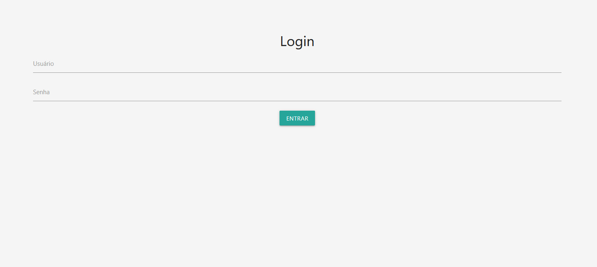
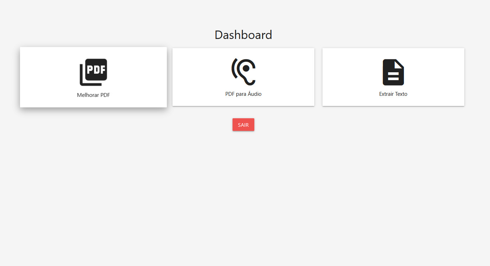
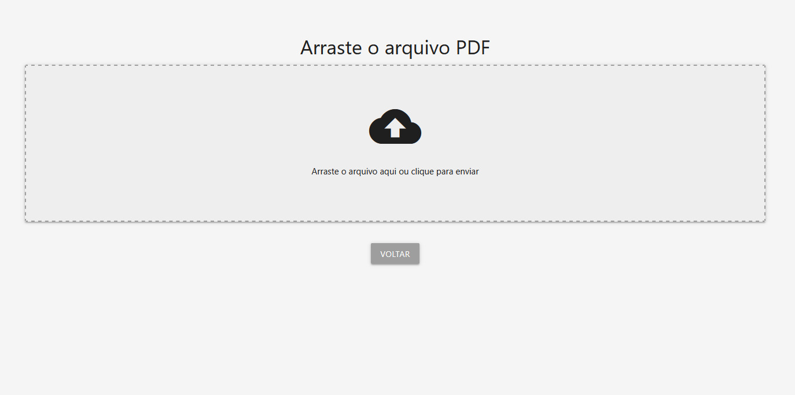
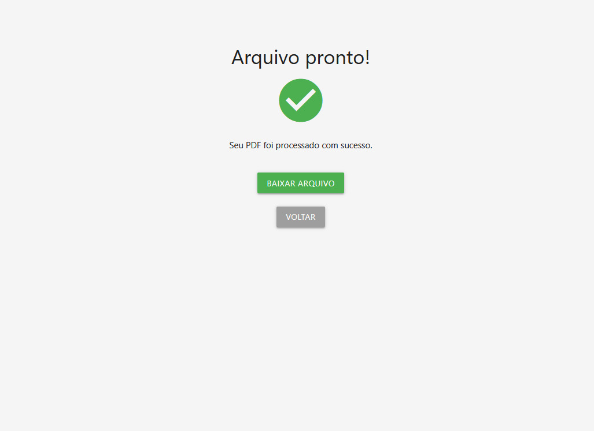

# TESTE DE FRONT-END PARA O FLAMEL

[FLAMEL](https://github.com/marviniciuz/flamel)

Modelo para ser usado ou testado em possivel atualização do front do flamel 

telas:

## LOGIN:

## DASHBOARD:

## TELA DE ARRASTAR PDF:

Essa tela não muda independentemente da opção selecionada no Dashboard

## TRANSFORMAÇÃO FINALIZADA:

#### TECNOLOGIAS

* html
* css
* javascript (para fluxo de telas e botões)
* [Materializecss](https://materializecss.com/)